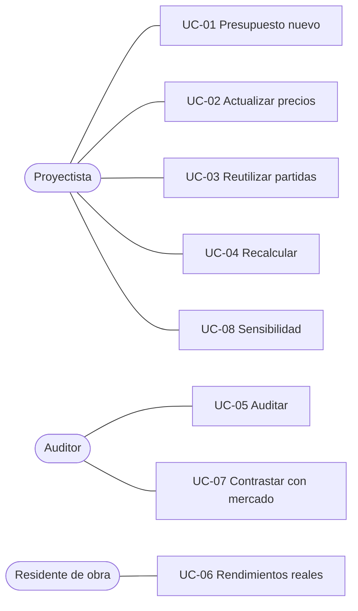
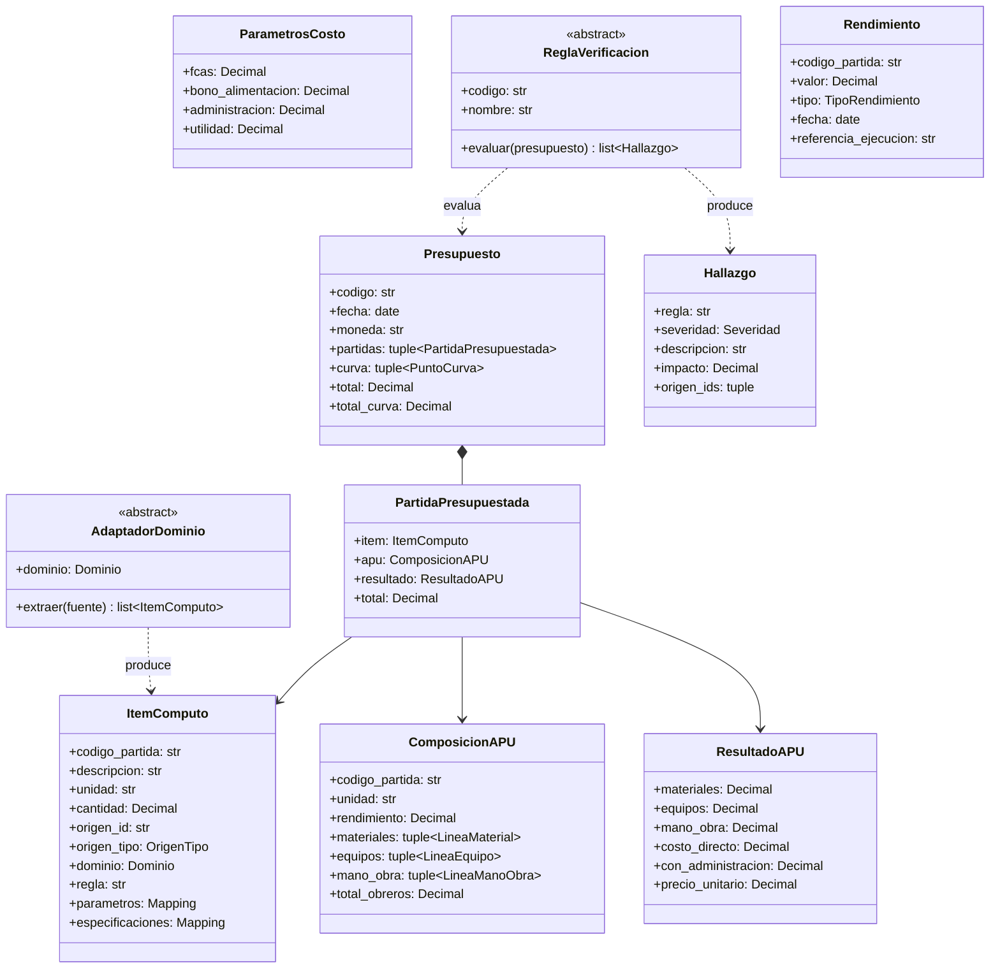
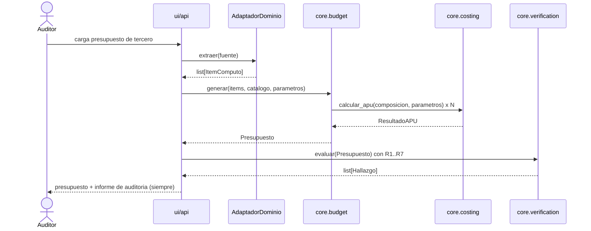
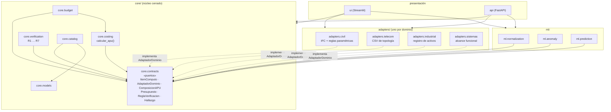

# Arquitectura del sistema (vistas 4+1 de Kruchten)

> Estado: **esqueleto con la vista de desarrollo y el diagrama de clases de los contratos ya
> definitivos**, porque reflejan el código que existe. Las demás vistas se completan en la Sesión 0.3
> de [PLAN_DESARROLLO.md](../PLAN_DESARROLLO.md) (marcadas `[0.3]`).

## 0. Estilo arquitectónico

Núcleo cerrado con adaptadores de dominio (puertos y adaptadores): `core/contracts/` define los
puertos; `adapters/*` y `ml/*` los implementan o los consumen; `ui/` y `api/` orquestan. El motor de
costos es una función pura; la verificación es independiente del aprendizaje automático. Las capas de
procesamiento (Bases del anteproyecto §9.1) se mapean así:

| Capa | Paquete |
|---|---|
| Modelado paramétrico e intercambio IFC | externo (Revit / Bonsai) → `data/samples/*.ifc` |
| Extracción de cantidades | `adapters/civil` (y un adaptador por dominio) |
| Base de datos de APU | `core/models`, `core/catalog` |
| Motor de costos | `core/costing` |
| Presupuesto y curva | `core/budget` |
| Aprendizaje automático | `ml/normalization`, `ml/anomaly`, `ml/prediction` |
| Verificación | `core/verification` |
| Presentación | `ui/` (Streamlit), `api/` (FastAPI) |

## 1. Vista de casos de uso `[0.3]`

Actores: proyectista/estimador, auditor, residente de obra, administrador del catálogo (ver
[ERS §2.3](ERS.md#23-características-de-los-usuarios)). Casos de uso UC‑01 … UC‑08 (ERS §2.2).

`[0.3]` Diagrama de casos de uso completo con relaciones include/extend (p. ej. UC‑05 incluido en UC‑01).

## 2. Vista lógica

### 2.1 Contratos (`core/contracts`, definitivo)

### 2.2 Clases del núcleo `[0.3]`
`core.costing.calcular_apu(ComposicionAPU, ParametrosCosto) -> ResultadoAPU`; `core.budget`
(generación de presupuesto y curva); `core.verification` (R1 … R7 como subclases de `ReglaVerificacion`
y el `InformeAuditoria`); `core.catalog` (repositorios). Diagrama de clases en la Sesión 0.3.

## 3. Vista de proceso `[0.3]`

Diagramas de secuencia de UC‑02 (actualización masiva de precios) y UC‑05 (auditoría). Esbozo de UC‑05:

## 4. Vista de desarrollo (definitivo)

El diagrama de componentes es el más importante del trabajo: debe hacer evidente que **agregar un
adaptador no toca el núcleo**. Las flechas son dependencias de importación; `tests/unit/test_arquitectura.py`
las verifica en cada ejecución de la suite.

Interfaces provistas y requeridas:

| Componente | Provee | Requiere |
|---|---|---|
| `core.contracts` | todos los tipos de intercambio | biblioteca estándar |
| `core.costing` | `calcular_apu` | `core.contracts` |
| `core.budget` | `generar_presupuesto`, `generar_curva`, `exportar_excel` | `core.contracts`, `core.costing`, `core.catalog` |
| `core.verification` | R1 … R7, `InformeAuditoria` | `core.contracts` |
| `adapters.<dominio>` | una subclase de `AdaptadorDominio` | `core.contracts` únicamente |
| `ml.*` | `normalizar`, `detectar_anomalias`, `predecir_precio` | `core.contracts` únicamente |
| `ui`, `api` | los ocho casos de uso | todo lo anterior |

Regla de dependencia: ninguna flecha entra a `core/` desde fuera, y ninguna sale de `core/` hacia
`adapters/`, `ml/`, `ui/` o `api/`.

## 5. Vista física `[0.3]`

Esbozo: una estación de trabajo con Python 3.13, SQLite local, Streamlit y FastAPI en procesos locales;
el modelador BIM (Revit / Bonsai) exporta IFC a `data/samples/`. Diagrama de despliegue en la Sesión 0.3.

## 6. Decisiones de arquitectura

| ADR | Decisión | Motivo | Consecuencia |
|---|---|---|---|
| 1 | Procesar IFC, nunca el formato nativo del modelador | independencia tecnológica, reproducibilidad | compuerta G1 vigila la pérdida de información en la exportación |
| 2 | Núcleo cerrado; dominios solo por `AdaptadorDominio` | es la hipótesis central del trabajo | `test_arquitectura.py` y `git diff --stat core/` como evidencia |
| 3 | `Decimal` en todo número del dominio | errores de redondeo invisibles en presupuestos | los adaptadores convierten en la frontera |
| 4 | Motor de costos como función pura | verificable contra la línea base sin infraestructura | persistencia y presentación son capas aparte |
| 5 | Verificación independiente del aprendizaje automático | resultado defendible aunque falten datos para ML | Fase 3 antes que Fase 5 |
| 6 | Tipos de presupuesto y hallazgo dentro de los contratos | las reglas se escriben contra una forma estable en memoria | los modelos SQLAlchemy mapean desde y hacia esos tipos |
