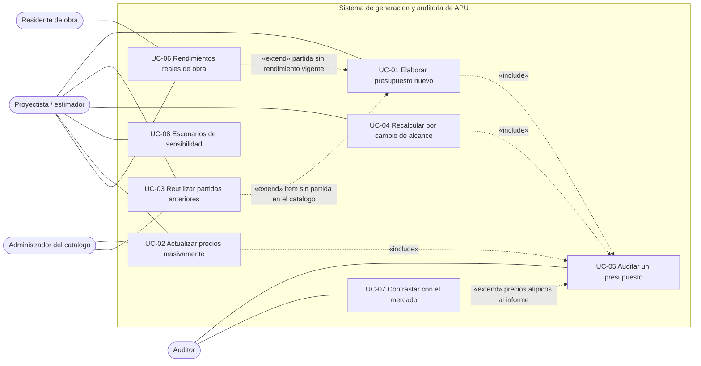
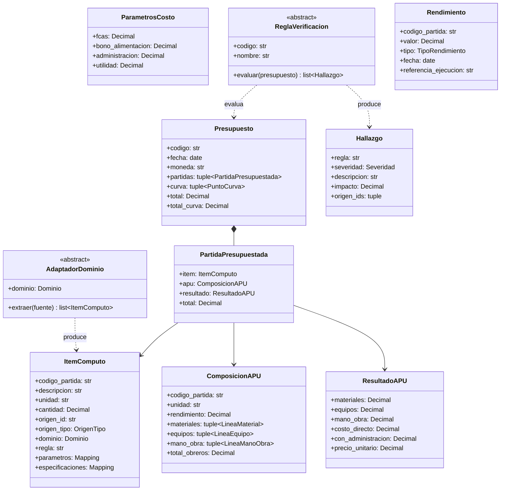
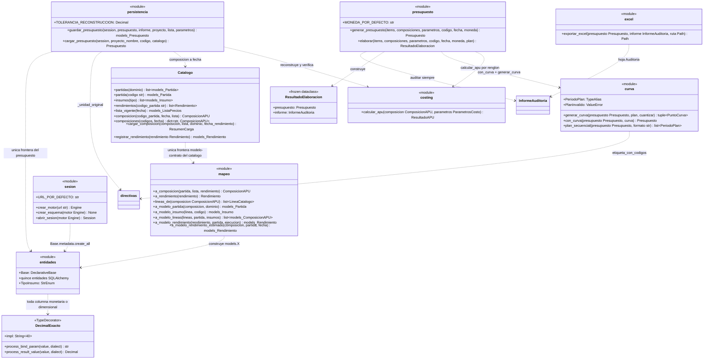
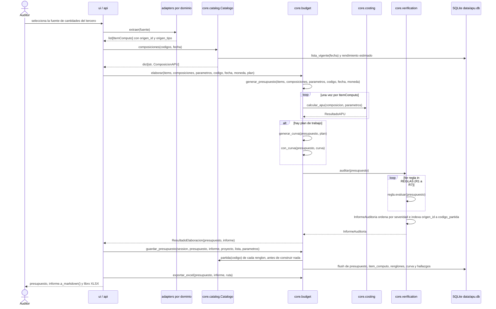
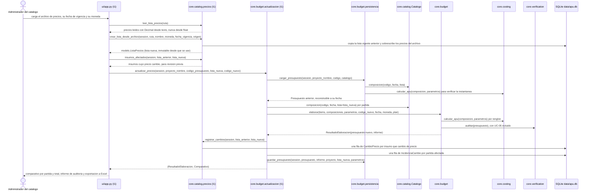
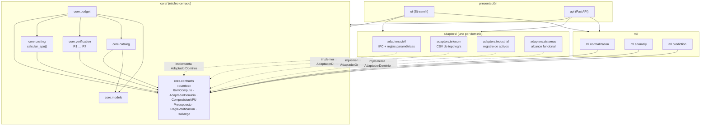
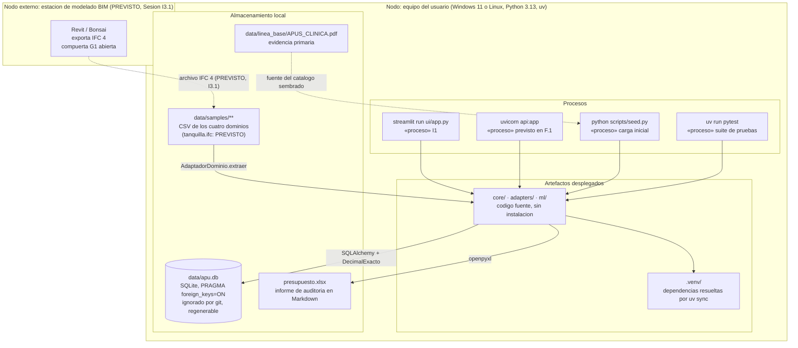

# Arquitectura del sistema (vistas 4+1 de Kruchten)

> Estado: **completo, pendiente de revisión del tutor (compuerta G0,
> [docs/metodologia.md §2.2](metodologia.md#22-compuertas))**. Completado en la Sesión 0.3 de
> [PLAN_DESARROLLO.md](../PLAN_DESARROLLO.md); criterio de cierre exigido: cinco vistas documentadas.
> Las cinco vistas describen **el código que existe** (Sesiones I0.1 – I5): las firmas de la vista
> lógica y los mensajes de la vista de proceso se copiaron de los módulos, no se diseñaron aquí. Lo
> que todavía no está implementado se marca con la sesión que lo entrega y no se dibuja como si
> existiera.
> Este documento no reproduce datos que tienen fuente única: enlaza [CLAUDE.md](../CLAUDE.md),
> [docs/ERS.md](ERS.md), [docs/modelo_datos.md](modelo_datos.md) y
> [docs/linea_base.md](linea_base.md) (principio DRY,
> [metodologia.md §5](metodologia.md#5-dry)).

| Campo | Valor |
|---|---|
| Versión | 1.0 |
| Fecha | 2026‑08‑29 |
| Autor | [tesista] |
| Revisor | [tutor académico] |

## 0. Estilo arquitectónico

Núcleo cerrado con adaptadores de dominio (puertos y adaptadores): `core/contracts/` define los
puertos; `adapters/*` y `ml/*` los implementan o los consumen; `ui/` y `api/` orquestan. El motor de
costos es una función pura; la verificación es independiente del aprendizaje automático. Las capas de
procesamiento (Bases del anteproyecto §9.1) se mapean así:

| Capa | Paquete |
|---|---|
| Modelado paramétrico e intercambio IFC | externo (Revit / Bonsai) → `data/samples/*.ifc` |
| Extracción de cantidades | `adapters/civil` (y un adaptador por dominio) |
| Base de datos de APU | `core/models`, `core/catalog` |
| Motor de costos | `core/costing` |
| Presupuesto y curva | `core/budget` |
| Aprendizaje automático | `ml/normalization`, `ml/anomaly`, `ml/prediction` |
| Verificación | `core/verification` |
| Presentación | `ui/` (Streamlit), `api/` (FastAPI) |

## 1. Vista de casos de uso

Actores y casos de uso están definidos en [ERS §2.2](ERS.md#22-funciones-del-producto-casos-de-uso) y
[ERS §2.3](ERS.md#23-características-de-los-usuarios); esta vista **no los redefine**: los dibuja con
sus relaciones y dice qué paquete realiza cada uno.



**Por qué UC‑05 es `«include»` y no `«extend»`.** No es una decisión de modelado: el código lo impone.
`core.budget.elaborar` llama siempre a `core.verification.auditar` y devuelve un
`ResultadoElaboracion` que lleva presupuesto **e** informe, de modo que no existe forma de obtener uno
sin el otro (principio 7 de [CLAUDE.md §2](../CLAUDE.md#2-principios)). UC‑02 y UC‑04 producen su
versión nueva por la misma función, así que heredan la inclusión.

Las tres relaciones `«extend»` corresponden a flujos alternativos del ERS (UC‑01 *3a* y *3b*, UC‑07
paso 5) y no están implementadas todavía: son las Sesiones I2, I6.2 e I6.3. Dos reutilizaciones más
que el ERS menciona en flujos alternativos no se dibujan porque no son relaciones entre casos de uso
completos, sino de un paso: UC‑04 *2a* reimporta el modelo con el paso 2 de UC‑01, y UC‑08 *2a* usa el
mecanismo de UC‑02 sin persistir la lista.

| UC | Realizado por | Estado |
|---|---|---|
| UC‑01 | `adapters/<dominio>` → `core.catalog` → `core.budget.elaborar` → `core.budget.exportar_excel` | implementado (I0.5); extracción IFC pendiente (I3.1) |
| UC‑02 | `core.catalog.precios` → `core.budget.actualizacion` → `ui/app.py` | Sesión I1, en curso |
| UC‑03 | `ml/normalization` sobre `core.catalog` | pendiente (I2) |
| UC‑04 | `adapters/civil.reglas` → `core.budget.elaborar` | parcial: las reglas paramétricas existen (I3.2) |
| UC‑05 | `core.verification.auditar` sobre un `Presupuesto` | implementado (I4) |
| UC‑06 | `core.catalog.Catalogo.registrar_rendimiento` / `rendimientos` | parcial: persistencia (I0.4); dispersión y advertencia en I6.1–I6.2 |
| UC‑07 | `ml/anomaly`, `ml/prediction` | pendiente (I6.1, I6.3) |
| UC‑08 | recálculo con otros `ParametrosCosto` | pendiente (F.1) |

## 2. Vista lógica

### 2.1 Contratos (`core/contracts`, definitivo)



### 2.2 Clases y funciones del núcleo

El núcleo es en su mayor parte **funciones sobre contratos inmutables**, no jerarquías de objetos: los
módulos se dibujan con el estereotipo `<<module>>` y solo `core.catalog`, `core.verification` y
`core.models` aportan clases propias. En los diagramas los genéricos usan la notación de Mermaid
(`list~X~`) y se omiten los valores por defecto; las **firmas literales**, copiadas del código, están
en los listados que siguen a cada diagrama.

#### Cálculo, presupuesto y catálogo



`Catalogo` recibe una `Session` ya abierta y **no** importa `core.catalog.sesion`: quien la abre es
`abrir_sesion(motor)`, y quien decide confirmar o deshacer la transacción es siempre el llamador.

Firmas literales (`core/costing/motor.py`, `core/budget/*.py`, `core/catalog/*.py`,
`core/models/tipos.py`):

```python
# core.costing
def calcular_apu(composicion: ComposicionAPU, parametros: ParametrosCosto) -> ResultadoAPU

# core.budget.presupuesto
MONEDA_POR_DEFECTO = "USD"

@dataclass(frozen=True, slots=True)
class ResultadoElaboracion:
    presupuesto: Presupuesto
    informe: InformeAuditoria

def generar_presupuesto(
    items: Sequence[ItemComputo],
    composiciones: Mapping[str, ComposicionAPU],
    parametros: ParametrosCosto,
    codigo: str,
    fecha: date,
    moneda: str = MONEDA_POR_DEFECTO,
) -> Presupuesto

def elaborar(
    items: Sequence[ItemComputo],
    composiciones: Mapping[str, ComposicionAPU],
    parametros: ParametrosCosto,
    codigo: str,
    fecha: date,
    moneda: str = MONEDA_POR_DEFECTO,
    plan: Sequence[PeriodoPlan] | None = None,
) -> ResultadoElaboracion

# core.budget.curva
PeriodoPlan = tuple[str, Sequence[tuple[str, Decimal]]]

class PlanInvalido(ValueError): ...

def generar_curva(
    presupuesto: Presupuesto,
    plan: Sequence[PeriodoPlan],
    cuantizar: Decimal | None = None,
) -> tuple[PuntoCurva, ...]
def con_curva(presupuesto: Presupuesto, curva: Sequence[PuntoCurva]) -> Presupuesto
def plan_secuencial(presupuesto: Presupuesto, formato: str = FORMATO_PERIODO) -> list[PeriodoPlan]

# core.budget.persistencia
TOLERANCIA_RECONSTRUCCION = Decimal("0.000001")

def guardar_presupuesto(
    session: Session,
    presupuesto: Presupuesto,
    informe: InformeAuditoria,
    proyecto: models.Proyecto,
    lista: models.ListaPrecios,
    parametros: ParametrosCosto,
) -> models.Presupuesto

def cargar_presupuesto(
    session: Session, proyecto_nombre: str, codigo: str, catalogo: Catalogo
) -> Presupuesto

# core.budget.excel
def exportar_excel(presupuesto: Presupuesto, informe: InformeAuditoria, ruta: Path) -> Path

# core.catalog.repositorio
@dataclass(slots=True)
class ResumenCarga:
    partida: models.Partida
    insumos_nuevos: list[models.Insumo]
    variantes: list[models.Insumo]

class Catalogo:
    def __init__(self, sesion: Session) -> None
    def partidas(self, dominio: Dominio | str | None = None) -> list[models.Partida]
    def partida(self, codigo: str) -> models.Partida
    def insumos(self, tipo: models.TipoInsumo | str | None = None) -> list[models.Insumo]
    def rendimientos(self, codigo_partida: str) -> list[Rendimiento]
    def lista_vigente(self, fecha: date | None = None) -> models.ListaPrecios
    def composicion(
        self,
        codigo_partida: str,
        fecha: date | None = None,
        lista: models.ListaPrecios | None = None,
    ) -> ComposicionAPU
    def composiciones(
        self, codigos: Iterable[str], fecha: date | None = None
    ) -> dict[str, ComposicionAPU]
    def cargar_composicion(
        self,
        composicion: ComposicionAPU,
        lista: models.ListaPrecios,
        dominio: Dominio,
        fecha_rendimiento: date,
    ) -> ResumenCarga
    def registrar_rendimiento(self, rendimiento: Rendimiento) -> models.Rendimiento

class CatalogoIncompleto(LookupError): ...   # core.catalog.errores

# core.catalog.sesion
URL_POR_DEFECTO = "sqlite:///data/apu.db"

def crear_motor(url: str = URL_POR_DEFECTO) -> Engine
def crear_esquema(motor: Engine) -> None      # crea las quince tablas y sus indices
def abrir_sesion(motor: Engine) -> Session

# core.models.tipos
class DecimalExacto(TypeDecorator[Decimal]):
    impl = String(LONGITUD_DECIMAL)           # LONGITUD_DECIMAL = 40
    def process_bind_param(self, value: Any, dialect: Dialect) -> str | None
    def process_result_value(self, value: Any, dialect: Dialect) -> Decimal | None
```

Las quince entidades persistentes (`core/models/entidades.py`) no se repiten aquí: su diagrama
entidad‑relación y la justificación de la normalización están en
[docs/modelo_datos.md §3](modelo_datos.md#3-diagrama-entidadrelación).

#### Verificación

Es la única parte del núcleo con jerarquía de clases: siete reglas que implementan el mismo puerto.

```mermaid
classDiagram
    class ReglaVerificacion {
        <<abstract>>
        +codigo: ClassVar~str~
        +nombre: ClassVar~str~
        +evaluar(presupuesto Presupuesto) list~Hallazgo~
    }
    class TrazabilidadGeometrica {
        +codigo = R1
        +__init__(tolerancia_relativa Decimal)
        +evaluar(presupuesto Presupuesto) list~Hallazgo~
    }
    class CierreCurvaInversion {
        +codigo = R2
        +evaluar(presupuesto Presupuesto) list~Hallazgo~
    }
    class CoherenciaDimensional {
        +codigo = R3
        +evaluar(presupuesto Presupuesto) list~Hallazgo~
    }
    class CorrespondenciaEspecificaciones {
        +codigo = R4
        +evaluar(presupuesto Presupuesto) list~Hallazgo~
    }
    class BalanceVolumetrico {
        +codigo = R5
        +__init__(tolerancia_relativa Decimal)
        +evaluar(presupuesto Presupuesto) list~Hallazgo~
    }
    class CriterioDepreciacion {
        +codigo = R6
        +evaluar(presupuesto Presupuesto) list~Hallazgo~
    }
    class ConciliacionPresupuestoPlan {
        +codigo = R7
        +__init__(tolerancia Decimal)
        +evaluar(presupuesto Presupuesto) list~Hallazgo~
    }
    class informe {
        <<module>>
        +auditar(presupuesto Presupuesto, reglas) InformeAuditoria
        +DECIMALES_PRESENTACION: int
    }
    class InformeAuditoria {
        <<frozen dataclass>>
        +codigo_presupuesto: str
        +hallazgos: tuple~Hallazgo~
        +partida_por_origen: Mapping~str, str~
        +cumple: bool
        +por_severidad() dict~Severidad, int~
        +por_regla() dict~str, Hallazgos~
        +partida_de(hallazgo Hallazgo) str
        +a_markdown() str
    }
    class expresiones {
        <<module>>
        +evaluar(expresion str, valores) Decimal
        +nombres_de(expresion str) frozenset~str~
        +codigos_de(expresion str) tuple~str~
        +sustituir_codigos(expresion str, cantidades) str
        +ExpresionInvalida: ValueError
        +ParametroFaltante: KeyError
    }
    class directivas {
        <<module>>
        +es_directiva(clave str) bool
        +etiqueta_con_codigos(etiqueta str, codigos) str
        +codigos_en_etiqueta(periodo str) tuple~str~
        +CLAVE_BALANCE: str
        +CLAVE_TOLERANCIA: str
        +CLAVE_UNIDAD_ORIGINAL: str
    }
    class texto {
        <<module>>
        +normalizar_texto(texto str) str
        +tokens(texto str) list~str~
        +es_numero(token str) bool
        +pares_numero_unidad(tokens_del_texto) list~tuple~
        +formatear_decimal(valor Decimal, decimales int) str
    }

    ReglaVerificacion <|-- TrazabilidadGeometrica
    ReglaVerificacion <|-- CierreCurvaInversion
    ReglaVerificacion <|-- CoherenciaDimensional
    ReglaVerificacion <|-- CorrespondenciaEspecificaciones
    ReglaVerificacion <|-- BalanceVolumetrico
    ReglaVerificacion <|-- CriterioDepreciacion
    ReglaVerificacion <|-- ConciliacionPresupuestoPlan
    informe ..> ReglaVerificacion : corre REGLAS en orden
    informe ..> InformeAuditoria : construye
    TrazabilidadGeometrica ..> expresiones : reevalua item.regla
    BalanceVolumetrico ..> expresiones : evalua el balance
    BalanceVolumetrico ..> directivas : _balance y _tolerancia
    CoherenciaDimensional ..> directivas : _unidad_original
    CorrespondenciaEspecificaciones ..> directivas : ignora toda clave con prefijo _
    CorrespondenciaEspecificaciones ..> texto : normaliza y compara
    CriterioDepreciacion ..> texto : normaliza descripciones
    ConciliacionPresupuestoPlan ..> directivas : codigos_en_etiqueta
    ConciliacionPresupuestoPlan ..> texto : heuristica textual si no hay codigos
    InformeAuditoria ..> texto : formatear_decimal
```



Firmas literales (`core/verification/*.py`):

```python
# core.verification.informe
DECIMALES_PRESENTACION = 2

@dataclass(frozen=True, slots=True)
class InformeAuditoria:
    codigo_presupuesto: str
    hallazgos: tuple[Hallazgo, ...] = ()
    partida_por_origen: Mapping[str, str] = field(default_factory=dict)

    @property
    def cumple(self) -> bool
    def por_severidad(self) -> dict[Severidad, int]
    def por_regla(self) -> dict[str, list[Hallazgo]]
    def partida_de(self, hallazgo: Hallazgo) -> str | None
    def a_markdown(self) -> str

def auditar(
    presupuesto: Presupuesto, reglas: Sequence[ReglaVerificacion] = REGLAS
) -> InformeAuditoria

# core.verification.reglas  (codigo y nombre son ClassVar[str] en cada clase)
class TrazabilidadGeometrica(ReglaVerificacion):        # R1
    def __init__(self, tolerancia_relativa: Decimal = Decimal("0.001")) -> None
    def evaluar(self, presupuesto: Presupuesto) -> list[Hallazgo]
class CierreCurvaInversion(ReglaVerificacion): ...      # R2
class CoherenciaDimensional(ReglaVerificacion): ...     # R3
class CorrespondenciaEspecificaciones(ReglaVerificacion): ...  # R4
class BalanceVolumetrico(ReglaVerificacion):            # R5
    def __init__(self, tolerancia_relativa: Decimal = Decimal("0.05")) -> None
class CriterioDepreciacion(ReglaVerificacion): ...      # R6
class ConciliacionPresupuestoPlan(ReglaVerificacion):   # R7
    def __init__(self, tolerancia: Decimal = Decimal("0.01")) -> None

REGLAS: tuple[ReglaVerificacion, ...] = (               # el orden del informe
    TrazabilidadGeometrica(), CierreCurvaInversion(), CoherenciaDimensional(),
    CorrespondenciaEspecificaciones(), BalanceVolumetrico(), CriterioDepreciacion(),
    ConciliacionPresupuestoPlan(),
)

# core.verification.expresiones
class ExpresionInvalida(ValueError): ...
class ParametroFaltante(KeyError): ...

def evaluar(expresion: str, valores: Mapping[str, Decimal]) -> Decimal
def nombres_de(expresion: str) -> frozenset[str]
def codigos_de(expresion: str) -> tuple[str, ...]
def sustituir_codigos(expresion: str, cantidades: Mapping[str, Decimal]) -> str

# core.verification.directivas
PREFIJO_DIRECTIVA = "_"
CLAVE_BALANCE = "_balance"
CLAVE_TOLERANCIA = "_tolerancia"
CLAVE_UNIDAD_ORIGINAL = "_unidad_original"

def es_directiva(clave: str) -> bool
def etiqueta_con_codigos(etiqueta: str, codigos: Sequence[str]) -> str
def codigos_en_etiqueta(periodo: str) -> tuple[str, ...]

# core.verification.texto
def normalizar_texto(texto: str) -> str
def tokens(texto: str) -> list[str]
def es_numero(token: str) -> bool
def pares_numero_unidad(tokens_del_texto: list[str]) -> list[tuple[str, str]]
def formatear_decimal(valor: Decimal, decimales: int | None = None) -> str
```

Qué comprueba cada regla y qué hallazgo de la línea base detecta: [CLAUDE.md
§7](../CLAUDE.md#7-siete-reglas-de-verificación-coreverification-sesión-i4) y
[docs/linea_base.md](linea_base.md). Ninguna regla nombra un dominio, una unidad concreta ni un código
del caso de estudio: lo que necesitan saber se lo dice el propio `Presupuesto` (ADR 8).

### 2.3 Los adaptadores

Cuatro adaptadores implementan el mismo puerto y ninguno aparece en los diagramas del núcleo, porque
el núcleo no los conoce. Todos importan **solo** `core.contracts`.

| Adaptador | Clase | `dominio` | Fuente | `origen_id` | `origen_tipo` |
|---|---|---|---|---|---|
| `adapters/civil` | `AdaptadorCivilTabular(codigos: Mapping[str, str])` | `Dominio.CIVIL` | `data/samples/civil/tanquillas_y_zanja.csv` | columna `id`; el relleno cita todas las filas que balancea | `REGLA` |
| `adapters/telecom` | `AdaptadorTelecom()` | `Dominio.TELECOM` | `data/samples/telecom/topologia_arenaza.csv` | columna `id` | `CSV` (nodo) · `REGLA` (enlace) |
| `adapters/industrial` | `AdaptadorIndustrial()` | `Dominio.INDUSTRIAL` | `data/samples/industrial/activos_planta.csv` | columna `id_activo` | `REGLA` |
| `adapters/sistemas` | `AdaptadorSistemas()` | `Dominio.SISTEMAS` | `data/samples/sistemas/alcance_funcional.csv` | columna `id` | `REGLA` |

Todos exponen la misma operación, la del contrato: `extraer(self, fuente: Path | str) -> list[ItemComputo]`.
El adaptador civil añade sus reglas paramétricas como texto trazable
(`REGLA_CONCRETO_TANQUILLA`, `REGLA_ENCOFRADO_TANQUILLA`, `REGLA_EXCAVACION_TANQUILLA`,
`REGLA_EXCAVACION_ZANJA`, `REGLA_TUBERIA`, `REGLA_VOLUMEN_TUBERIA`, `REGLA_RELLENO` en
`adapters/civil/reglas.py`) y las evalúa con `adapters/civil/evaluador.py::evaluar_regla`.

## 3. Vista de proceso

El sistema es de **un solo proceso y un solo hilo**: no hay concurrencia que documentar, y esa es una
decisión (ADR 9). Lo que sí importa es el orden real de las llamadas y dónde empieza y termina una
transacción de base de datos.

### 3.1 UC‑05 — Auditar un presupuesto (incluido en UC‑01, UC‑02 y UC‑04)

Mensajes tomados de `core/budget/presupuesto.py::elaborar`, `core/verification/informe.py::auditar` y
`core/budget/persistencia.py::guardar_presupuesto`.



Cuatro detalles del orden real que el diagrama fija y que conviene no perder:

1. **`auditar` es el último paso de `elaborar`, no una llamada aparte del usuario.** El informe existe
   antes de que nadie lo pida.
2. **Ninguna regla aborta el informe.** `auditar` recorre las siete y concatena sus hallazgos; una
   expresión inevaluable produce un `Hallazgo`, no una excepción.
3. **`guardar_presupuesto` hace `flush`, no `commit`**: la transacción pertenece a quien llama, de
   modo que el presupuesto puede formar parte de una operación mayor (por ejemplo, la de UC‑02).
   Rechaza con `ValueError` un informe cuyo `codigo_presupuesto` no sea el del presupuesto.
4. **`cargar_presupuesto` es la operación inversa y verifica**: revalora cada renglón con
   `Catalogo.composicion` sobre la lista que el presupuesto referencia, lo pasa por `calcular_apu` y
   compara con la instantánea guardada; si difieren en más de `TOLERANCIA_RECONSTRUCCION`
   (1 × 10⁻⁶) lanza `ValueError` en vez de devolver un documento adulterado. Devuelve la
   **instantánea**, no el recálculo.

### 3.2 UC‑02 — Actualizar masivamente los precios *(Sesión I1, en curso)*

> Los nombres de `core/catalog/precios.py`, `core/budget/actualizacion.py` y `ui/app.py` están fijados
> por el brief de la Sesión I1, que se implementa en paralelo a esta sesión. **El integrador debe
> verificar esta secuencia al fusionar I1**; el resto del diagrama (`cargar_presupuesto`,
> `composicion`, `calcular_apu`, `auditar`, `guardar_presupuesto`) sí es código existente.



Lo que esta secuencia hace evidente: **actualizar precios no edita ninguna composición ni ninguna
lista usada**. Crea una lista nueva con vigencia posterior, revalora el mismo cómputo con ella y emite
una versión nueva del presupuesto; el presupuesto anterior sigue reconstruyéndose a su fecha
(RNF‑02). Es la estrategia de versionado híbrido de
[docs/modelo_datos.md §5](modelo_datos.md#5-estrategia-de-versionado).

## 4. Vista de desarrollo (definitivo)

El diagrama de componentes es el más importante del trabajo: debe hacer evidente que **agregar un
adaptador no toca el núcleo**. Las flechas son dependencias de importación: las que cruzan la
frontera de `core/` las verifica `tests/unit/test_arquitectura.py` en cada ejecución de la suite; las
internas del núcleo se mantienen por revisión (ver el final de esta sección).



Interfaces provistas y requeridas:

| Componente | Provee | Requiere |
|---|---|---|
| `core.contracts` | todos los tipos de intercambio | biblioteca estándar |
| `core.costing` | `calcular_apu` | `core.contracts` |
| `core.budget` | `generar_presupuesto`, `elaborar`, `generar_curva`, `plan_secuencial`, `con_curva`, `guardar_presupuesto`, `cargar_presupuesto`, `exportar_excel` | `core.contracts`, `core.costing`, `core.verification`, `core.catalog`, `core.models` |
| `core.verification` | R1 … R7, `REGLAS`, `auditar`, `InformeAuditoria` | `core.contracts` |
| `core.catalog` | `Catalogo`, `crear_motor`, `crear_esquema`, `abrir_sesion` | `core.contracts`, `core.models` |
| `adapters.<dominio>` | una subclase de `AdaptadorDominio` | `core.contracts` únicamente |
| `ml.*` | `normalizar`, `detectar_anomalias`, `predecir_precio` | `core.contracts` únicamente |
| `ui`, `api` | los ocho casos de uso | todo lo anterior |

Regla de dependencia: ninguna flecha entra a `core/` desde fuera, y ninguna sale de `core/` hacia
`adapters/`, `ml/`, `ui/` o `api/`.

Las dependencias **internas** de `core/` no son libres de dirección pero sí de capa: `core.budget` es
el orquestador (usa costing, verification y catalog) y `core.contracts` es hoja. `test_arquitectura.py`
vigila las dos fronteras externas, no esta estratificación interna, que se mantiene por revisión.

## 5. Vista física

Ejecución **local, sin servidor y sin credenciales** (RNF‑08 de
[ERS §3.3](ERS.md#33-requisitos-no-funcionales-isoiec-25010)): un solo equipo, procesos que arrancan y
terminan con el usuario, y un archivo SQLite como toda la base de datos. No hay llamadas de red en
tiempo de ejecución; la única excepción declarada es la descarga inicial del modelo de
`sentence-transformers` (Sesión I2), que se cachea localmente.

Lo punteado y marcado *PREVISTO* no existe todavía: la **compuerta G1 sigue abierta**
([CLAUDE.md §8.2](../CLAUDE.md#8-compuertas-y-criterios-de-degradación)), no hay estación de
modelado en el despliegue ni `data/samples/tanquilla.ifc` en el repositorio, y la entrada civil
vigente es tabular (`adapters/civil/tabular.py` sobre
`data/samples/civil/tanquillas_y_zanja.csv`). El resto del diagrama es lo que hoy se ejecuta.



Decisiones de despliegue y sus consecuencias:

| Aspecto | Decisión | Consecuencia |
|---|---|---|
| Base de datos | SQLite en `data/apu.db`, URL por defecto de `core.catalog.sesion.crear_motor` | sin instalación de servidor; `.gitignore` ignora `*.db` (en cualquier carpeta) y la base se regenera con `uv run python scripts/seed.py` |
| Integridad referencial | `PRAGMA foreign_keys=ON` en cada conexión SQLite | sin él, el motor ignora las claves foráneas y el esquema deja de ser el documentado |
| Portabilidad del motor | PostgreSQL se activa cambiando la URL y sustituyendo `DecimalExacto` por `Numeric(18, 6)` | ningún modelo cambia (ADR 7) |
| Entorno | `uv sync` (RNF‑07), extras por capa: `ui`, `api`, `civil`, `ml` | el equipo del proyectista no necesita `ifcopenshell` ni `torch` para presupuestar |
| Pruebas | SQLite **en memoria**; ninguna prueba escribe en `data/` salvo con `tmp_path` | la base del usuario nunca se altera al correr la suite |
| Seguridad | sin credenciales, sin servicios externos, sin datos fuera del equipo | RNF‑08; el respaldo es copiar un archivo |
| Escalado | ninguno: un usuario, un proceso | si el trabajo se colaboriza, `api/` (F.1) más PostgreSQL es el camino, y solo cambia `crear_motor` |

## 6. Decisiones de arquitectura

| ADR | Decisión | Motivo | Consecuencia |
|---|---|---|---|
| 1 | Procesar IFC, nunca el formato nativo del modelador | independencia tecnológica, reproducibilidad | compuerta G1 vigila la pérdida de información en la exportación |
| 2 | Núcleo cerrado; dominios solo por `AdaptadorDominio` | es la hipótesis central del trabajo | `test_arquitectura.py` y `git diff --stat core/` como evidencia |
| 3 | `Decimal` en todo número del dominio | errores de redondeo invisibles en presupuestos | los adaptadores convierten en la frontera |
| 4 | Motor de costos como función pura | verificable contra la línea base sin infraestructura | persistencia y presentación son capas aparte |
| 5 | Verificación independiente del aprendizaje automático | resultado defendible aunque falten datos para ML | Fase 3 antes que Fase 5 |
| 6 | Tipos de presupuesto y hallazgo dentro de los contratos | las reglas se escriben contra una forma estable en memoria | los modelos SQLAlchemy mapean desde y hacia esos tipos |
| 7 | `DecimalExacto`: los `Decimal` se persisten como **texto** en SQLite (`TypeDecorator` con `impl = String(40)`), no con `Float` ni con `Numeric` | SQLite no tiene decimal nativo: `Numeric` almacena `REAL` y reconvierte **pasando por `float`**, lo que emite `SAWarning` y admite pérdida de precisión, contra el principio 3 | el texto conserva dígitos y escala (`Decimal("0.415")` vuelve idéntico) y la suite corre sin advertencias; a cambio, ordenar o filtrar por importe en SQL sería lexicográfico (ninguna consulta lo hace). El mismo criterio rige los `Decimal` dentro de las columnas JSON‑texto. En PostgreSQL se sustituye por `Numeric(18, 6)` sin tocar los modelos. Detalle en [modelo_datos.md §7.1](modelo_datos.md#71-decimalexacto-el-tipo-monetario-y-dimensional) |
| 8 | **El balance y la regla que produjo una cantidad son datos del ítem, no código del núcleo.** La expresión viaja en `ItemComputo.regla` con sus `parametros`; el balance volumétrico y su tolerancia, en las directivas `_balance` y `_tolerancia` de `especificaciones`; la unidad tal como la escribió el autor, en `_unidad_original` | Si R1 y R5 conocieran las fórmulas del drenaje, el núcleo conocería el dominio civil y la hipótesis central sería falsa. El núcleo solo sabe **evaluar aritmética** (`core.verification.expresiones`) y **leer una convención de claves** (`core.verification.directivas`) | agregar un dominio no añade una rama al núcleo: el adaptador declara sus expresiones y el núcleo las reevalúa. Precio pagado: el evaluador de AST está **duplicado** entre `core/verification/expresiones.py` y `adapters/civil/evaluador.py`, porque la regla de dependencia impide compartirlo; una prueba de equivalencia evalúa cada `REGLA_*` civil con ambos y exige el mismo `Decimal`. Candidato a `core.contracts.expresiones` en la revisión de contratos posterior a la Fase 1 ([bitácora I4](bitacora/2026-08-29-I4-verificacion.md), hallazgo 1) |
| 9 | El sistema es de un proceso y un hilo; el informe viaja **dentro** del resultado (`ResultadoElaboracion`) | principio 7 de CLAUDE.md §2: el informe se genera siempre. Un tipo que lleva las dos cosas lo hace imposible de omitir | no hay concurrencia que documentar en la vista de proceso; la transacción es responsabilidad del llamador (`flush`, no `commit`) |
| 10 | Versionado híbrido: el presupuesto **referencia** su lista de precios y además **congela** el `ResultadoAPU` de cada renglón | responden preguntas distintas: qué se firmó y cuánto costaría hoy | `cargar_presupuesto` revalora y compara con la instantánea (tolerancia 1 × 10⁻⁶); como el contrato `Presupuesto` no lleva `ParametrosCosto`, los cuatro parámetros se copian en la fila del presupuesto ([bitácora I0.5](bitacora/2026-08-29-I0.5-presupuesto.md), hallazgo 2) |
| 11 | El enlace período → partida viaja en la **etiqueta** del punto de curva, entre corchetes (`"Dia 1 [LB-01-EXC]"`), con `etiqueta_con_codigos` / `codigos_en_etiqueta` como único par inverso | `PuntoCurva` no tiene campo para el código de partida y `core/contracts/` está congelado; R7 necesita ese enlace para conciliar el plan con el presupuesto | funciona sin tocar los contratos, pero R7 depende de una convención textual y, si la etiqueta no la declara, cae a una heurística de contención de descripciones. Un campo `codigos_partida: tuple[str, ...]` en `PuntoCurva` lo eliminaría ([bitácora I4](bitacora/2026-08-29-I4-verificacion.md), hallazgo 3) |
| 12 | La frontera modelo ↔ contrato existe en **exactamente dos** módulos: `core/catalog/mapeo.py` (catálogo) y `core/budget/persistencia.py` (presupuesto) | unirlas habría hecho que `core.catalog` dependiera de `core.verification` por el `InformeAuditoria` | siete nombres coinciden entre modelos y contratos: los modelos se importan **siempre cualificados** (`models.Presupuesto`). Si aparece una tercera frontera, conviene revisar la partición |

### 6.1 Deuda arquitectónica declarada

Ninguna de estas insuficiencias se parcheó tocando `core/contracts/` (regla de
[CLAUDE.md §9](../CLAUDE.md#9-cómo-trabajar-con-claude-code-en-este-repositorio)); todas están
rodeadas y documentadas, y son entrada de la revisión de contratos posterior a la Fase 1.

| Insuficiencia | Se rodea con | Registro |
|---|---|---|
| Evaluador de expresiones duplicado núcleo / adaptador civil | prueba de equivalencia entre ambos evaluadores | [I3.2](bitacora/2026-08-29-I3.2-civil.md) h.1, [I4](bitacora/2026-08-29-I4-verificacion.md) h.1 |
| `Hallazgo` no lleva `codigo_partida` | índice `partida_por_origen` que arma `auditar` y resuelve `InformeAuditoria.partida_de` | [I4](bitacora/2026-08-29-I4-verificacion.md) h.2 |
| `PuntoCurva` no lleva `codigo_partida` | códigos entre corchetes en la etiqueta (ADR 11) | [I4](bitacora/2026-08-29-I4-verificacion.md) h.3 |
| El criterio de amortización no es declarable en `LineaEquipo` | R6 verifica solo la mitad verificable (factor único por insumo) y lo dice en el hallazgo | [I4](bitacora/2026-08-29-I4-verificacion.md) h.4 |
| `Presupuesto` no lleva `ParametrosCosto` | las cuatro columnas de `models.Presupuesto` (ADR 10) | [I0.5](bitacora/2026-08-29-I0.5-presupuesto.md) h.2 |
| Insumos homónimos con dos precios el mismo día | variantes de insumo con sufijo `-B`; candidata a regla R8, a decidir con el tutor | [I0.4](bitacora/2026-08-29-0.2-I0.4-persistencia.md) h.1, [modelo_datos.md §6](modelo_datos.md#6-insumos-homónimos-con-precio-distinto-hallazgo-de-datos-de-la-sesión-i04) |
| Las líneas de `ComposicionAPU` no tienen vigencia temporal | limitación declarada: los presupuestos emitidos están congelados y no se ven afectados | [modelo_datos.md §5](modelo_datos.md#5-estrategia-de-versionado) |
