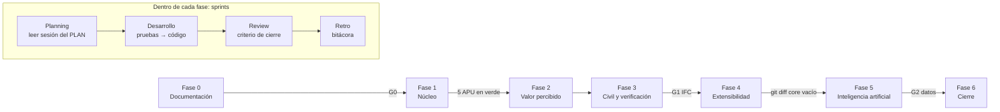

# Metodología de desarrollo: Scrum‑Cascada y DRY

Este documento define **cómo** se construye el sistema descrito en [CLAUDE.md](../CLAUDE.md) y
planificado en [PLAN_DESARROLLO.md](../PLAN_DESARROLLO.md). Es la referencia del capítulo
metodológico de la tesis en lo relativo al proceso de desarrollo de software.

---

## 1. Por qué un híbrido

Un trabajo de grado en sistemas exige entregables documentales secuenciales que un jurado evalúa
antes del código (ERS, modelo de datos, arquitectura, plan de pruebas). Eso es **cascada**. Pero el
sistema tiene riesgos técnicos que solo se despejan construyendo (¿se pueden extraer cantidades de un
IFC?, ¿habrá datos suficientes para predecir precios?) y el valor debe entregarse por incrementos
usables. Eso es **Scrum**.

La solución es una cascada de fases con **compuertas** (macro) dentro de la cual cada fase se
ejecuta como uno o más **sprints** con backlog, *Definition of Done* y revisión (micro). El PLAN ya
tiene esa forma: fases ordenadas con criterios de paso, y sesiones con objetivo, cierre y commit.



---

## 2. Capa cascada

### 2.1 Fases y entregables

| Fase | Producto verificable | Norma o técnica | Semanas |
|---|---|---|---|
| 0 Documentación | `docs/ERS.md`, `docs/modelo_datos.md`, `docs/arquitectura.md` | IEEE 830, modelo ER, vistas 4+1 | 3 – 8 |
| 1 Núcleo | contratos, motor de costos, persistencia, presupuesto y curva | pruebas antes que código | 8 – 11 |
| 2 Valor percibido | actualización masiva de precios (UC‑02), memoria semántica (UC‑03) | Streamlit mínimo | 11 – 16 |
| 3 Civil y verificación | adaptador IFC, reglas paramétricas, siete reglas de auditoría (UC‑04, UC‑05) | ifcopenshell | 16 – 21 |
| 4 Extensibilidad | adaptadores telecom, industrial y sistemas | `git diff --stat core/` vacío | 21 – 24 |
| 5 Inteligencia artificial | anomalías, rendimientos auditables, predicción (UC‑06, UC‑07) | Isolation Forest, XGBoost/CBR | 24 – 26 |
| 6 Cierre | interfaz completa, API, plan de pruebas, evaluación de calidad, manuales | IEEE 829, ISO/IEC 25010, OpenAPI | 26 – 28 |

### 2.2 Compuertas

Una compuerta es una decisión explícita, con criterio medible y alternativa prevista. No se cruza sin
registrar el resultado en la bitácora.

| Compuerta | Cuándo | Criterio de paso | Si no se cumple |
|---|---|---|---|
| **G0** documentación | antes de I0.3 | ERS, modelo de datos y arquitectura revisados por el tutor | se corrigen los documentos; no se escribe el motor |
| **G‑núcleo** | Sesión I0.3 | las cinco pruebas de `test_costing.py` en verde sin modificarlas | se revisa el motor, nunca la línea base |
| **G1** extracción IFC | Sesión I3.1 | cantidades extraídas de `tanquilla.ifc` = cálculo manual | el adaptador civil pasa a entrada tabular; se documenta la pérdida de independencia tecnológica |
| **G‑núcleo intacto** | Sesión I5 | `git diff --stat core/` vacío y `test_arquitectura.py` verde | el intento de cambio se documenta como hallazgo; se rediseña el adaptador o se declara insuficiencia del contrato |
| **G2** datos para ML | antes de I6.3 | conteo de registros por dominio contra la tabla de CLAUDE.md §8.1 | se degrada la técnica (XGBoost → CBR → reglas) y se declara la limitación |

### 2.3 Qué se congela al cruzar cada compuerta

- Tras **G0**: los ocho casos de uso y sus requerimientos funcionales numerados.
- Tras **G‑núcleo**: `core/contracts/` (congelado desde I0.1) y la fórmula de cálculo.
- Tras **G1**: la interfaz `AdaptadorDominio` queda demostrada con un dominio real.
- Tras **G‑núcleo intacto**: la hipótesis central queda evidenciada; `core/` solo recibe correcciones.

---

## 3. Capa Scrum

### 3.1 Roles

| Rol | Quién | Responsabilidad |
|---|---|---|
| Product Owner | tesista, con el tutor académico y el tutor técnico | prioriza el backlog (los UC), acepta o rechaza cada incremento |
| Scrum Master | tesista | protege las reglas: una sesión por incremento, compuertas, DoD |
| Equipo de desarrollo | tesista + Claude Code | construye; el tesista revisa y defiende cada diff |

### 3.2 Artefactos

| Artefacto Scrum | En este proyecto |
|---|---|
| Product Backlog | UC‑01 … UC‑08, refinados en RF‑xx de `docs/ERS.md`, priorizados por el orden de fases |
| Sprint Backlog | las sesiones del incremento en [PLAN_DESARROLLO.md](../PLAN_DESARROLLO.md), cada una con prompt, cierre y commit |
| Incremento | el estado del repositorio tras el commit de cierre; desde I1, algo que un profesional instalaría |
| Definition of Ready / Done | sección 3.4 |
| Bitácora | `docs/bitacora/AAAA-MM-DD-sprint-N.md`: qué se hizo, decisiones, hallazgos, impedimentos |

### 3.3 Eventos

| Evento | Cómo se ejecuta |
|---|---|
| Sprint Planning | leer CLAUDE.md y la sesión del PLAN; usar modo plan de Claude Code; confirmar la *Definition of Ready* |
| Daily | una entrada breve en la bitácora al abrir y cerrar cada sesión de trabajo |
| Sprint Review | verificar el criterio de "Cierre" de la sesión con evidencia (salida de pytest, diff, captura) |
| Retrospectiva | sección "Hallazgos y decisiones" de la bitácora; lo que afecta al proceso se lleva a este documento |

### 3.4 Definition of Ready y Definition of Done

**Definition of Ready** (para empezar una sesión):

- [ ] La sesión anterior cerró con su commit y su bitácora.
- [ ] Las compuertas previas están registradas como cruzadas.
- [ ] Los insumos externos existen (p. ej. `data/samples/tanquilla.ifc` antes de I3.1; conteo de registros antes de I6.3).
- [ ] Las dependencias de la capa están instaladas (`uv sync --extra <capa>`).

**Definition of Done** (para cerrar una sesión):

- [ ] El criterio de "Cierre" del PLAN se cumple y hay evidencia.
- [ ] `uv run pytest` verde, salvo los rojos declarados como esperados en README.
- [ ] `uv run ruff check .` sin hallazgos.
- [ ] Ninguna prueba de la línea base fue modificada para pasar.
- [ ] Si la sesión tocó `adapters/` o `ml/`: `git diff --stat core/` vacío.
- [ ] Commit convencional con el mensaje del PLAN; bitácora actualizada.
- [ ] Toda constante o dato nuevo tiene un único lugar (sección 5).

### 3.5 Mapa sprint ↔ sesiones

| Sprint | Sesiones | Incremento entregado |
|---|---|---|
| 0 (esqueleto) | constitución, contratos, línea base, esqueletos de docs | este repositorio |
| Fase 0 | 0.1, 0.2, 0.3 | ERS, modelo ER, arquitectura 4+1 |
| I0 | I0.3, I0.4, I0.5 | motor, persistencia, presupuesto y curva |
| I1 | I1 | actualización masiva de precios con registro de cambios |
| I2 | I2 | normalización semántica |
| I3 | I3.1, I3.2 | adaptador IFC y reglas paramétricas |
| I4 | I4 | verificación 7/7 |
| I5 | I5 | tres adaptadores sin tocar el núcleo |
| I6 | I6.1, I6.2, I6.3 | anomalías, rendimientos auditables, predicción |
| F | F.1, F.2, F.3 | interfaz, API, plan de pruebas, calidad, manuales |

---

## 4. Cómo conviven las dos capas

- La cascada decide **el orden y los documentos**; Scrum decide **cómo se ejecuta cada fase**.
- Un sprint nunca adelanta trabajo de una fase cuya compuerta no se ha cruzado.
- Un hallazgo dentro de un sprint que contradice un documento de fase anterior no se resuelve
  parcheando el código: se registra en la bitácora, se corrige el documento y se reabre la compuerta
  si hace falta. La regla del 80 % de CLAUDE.md §9 es el caso más importante de esta política.

---

## 5. DRY

"No te repitas": cada hecho, regla o dato del sistema tiene **una sola representación autorizada**;
todo lo demás la importa, la enlaza o se deriva de ella. En un trabajo con documentos, código, pruebas
y datos de un caso real, la duplicación es la forma más rápida de que dos lugares se contradigan
delante del jurado.

### 5.1 Fuentes únicas de verdad

| Hecho | Único lugar | Quién lo consume |
|---|---|---|
| Parámetros del cálculo (FCAS, bono, administración, utilidad) | `core/contracts/apu.py::ParametrosCosto` | motor, fixtures, docs (enlazan) |
| Fórmula del precio unitario | CLAUDE.md §4 (texto) → `core/costing/` (única implementación) | presupuesto, actualización de precios, API |
| Tipos que cruzan fronteras | `core/contracts/` | core, adapters, ml, ui, api, tests |
| Alias de unidades | `core/contracts/unidades.py` | contratos, regla R3 |
| Los 5 APU, cómputo, presupuesto, curva y 7 inconsistencias | `tests/fixtures/apu_linea_base.py` | `test_costing`, `test_linea_base`, `scripts/seed.py`, fixture de I4 |
| Fixtures de pytest | `tests/conftest.py` | toda la suite |
| Reglas paramétricas del dominio civil | `adapters/civil/reglas.py` (expresiones trazables) | cómputo, informe, docs |
| Estructura de carpetas y responsabilidades | CLAUDE.md §6 | README, arquitectura, manual técnico |
| Trazabilidad objetivo ↔ fase ↔ sesión ↔ producto ↔ indicador | `docs/tesis/esqueleto_tesis.md` | ERS, este documento, tesis |
| Regla "adaptadores solo importan `core.contracts`" | `tests/unit/test_arquitectura.py` | verificación automática de la hipótesis |

### 5.2 Reglas prácticas

1. Una constante numérica del negocio no se escribe dos veces: se importa de `ParametrosCosto` o del fixture.
2. Un documento no reproduce tablas de otro documento: las enlaza con ancla (`CLAUDE.md#4-...`).
3. Un dato de prueba se define en `tests/fixtures/` y se comparte por `conftest.py`; ningún test lo reescribe.
4. Una regla de negocio (cálculo, verificación, paramétrica) vive en una sola función o clase; la UI y la API la llaman.
5. Los contratos se importan siempre desde `core.contracts`; nunca se redefinen "parecidos" en otro paquete.
6. Cuando dos módulos necesitan el mismo helper, el helper sube al paquete común más cercano (nunca se copia).

### 5.3 Señales de violación

- Un número mágico (`0.15`, `6`, `1.05`) escrito en un módulo que no es su fuente.
- Un `dataclass` en `adapters/` o `ml/` con los mismos campos que uno de `core.contracts`.
- Un test que reconstruye a mano un APU que ya está en la línea base.
- Un documento que contiene la tabla de los cinco APU con cifras que no coinciden con el fixture.
- Un `if dominio == "civil"` dentro de `core/`: el núcleo no conoce dominios concretos.

### 5.4 Cómo se verifica

- `tests/unit/test_arquitectura.py` (dependencias) y `tests/unit/test_linea_base.py` (integridad del fixture).
- `ruff` con reglas de imports (`I`) y `B` para duplicaciones triviales.
- Revisión del diff en cada cierre de sesión con la pregunta: "¿este dato ya existía en otro lugar?".

---

## 6. Gestión de configuración

| Elemento | Convención |
|---|---|
| Rama principal | `main`: siempre instalable y con la suite en el estado declarado en README |
| Ramas de incremento | `inc/I1-actualizacion-precios`, `inc/I3-civil`, … creadas desde `main` a partir de I0.3 |
| Commits | Conventional Commits en español, asunto sin tildes, tipo(ámbito): `feat(core)`, `test(core)`, `docs(ers)`, `chore` |
| Etiquetas | una por compuerta cruzada: `g0-docs`, `g-nucleo`, `g1-ifc`, `g-nucleo-intacto`, `g2-datos` |
| Entorno | `uv sync`; extras por capa (`--extra civil`, `--extra ml`, `--extra ui --extra api`) |
| Datos | `data/linea_base/` es evidencia primaria y no se edita; `data/samples/` se versiona; las bases SQLite se regeneran con `scripts/seed.py` |

---

## 7. Trazabilidad

```
Objetivo específico ─► Fase ─► Sesión ─► UC ─► RF ─► prueba ─► commit ─► indicador de la tesis
```

- Cada RF de la ERS cita su UC; cada caso de prueba (IEEE 829, Sesión F.2) cita su RF.
- Cada commit lleva el ámbito del paquete que toca; el historial de `git log -- core/` es la evidencia de estabilidad del núcleo.
- La matriz completa está en [docs/tesis/esqueleto_tesis.md](tesis/esqueleto_tesis.md).

---

## 8. Indicadores de la tesis

| N.º | Indicador | Cómo se mide | Dónde nace |
|---|---|---|---|
| 1 | Inconsistencias detectadas | 7 de 7 sobre el presupuesto auditado | Sesión I4 |
| 2 | Exactitud del presupuesto generado | desviación % frente a la línea base corregida; clase 3 de AACE | Sesiones I0.5, I3.2 |
| 3 | Reducción del tiempo de elaboración | cronometraje manual vs automatizado (observación estructurada) | Fase 6 |
| 4 | Extensibilidad sin tocar el núcleo | `git diff --stat core/` vacío y `test_arquitectura.py` verde | Sesión I5 |
| 5 | Desempeño predictivo | MAPE, RMSE, R² por técnica | Sesión I6.3 |

---

## 9. Riesgos que gobiernan las compuertas

| Riesgo | Compuerta que lo controla | Previsión |
|---|---|---|
| Insuficiencia de datos para predecir precios | G2 | degradación XGBoost → CBR → reglas; normalización y anomalías no requieren etiquetas |
| Pérdida de información al exportar a IFC | G1 | prueba de concepto con un solo objeto; alternativa tabular documentada |
| Negativa de uso de la base comercial de precios | Fase 0 | catálogo reducido desde COVENIN 2000 y APU de trabajos previos |
| Objeción por replicar software existente | G‑núcleo intacto y R1–R7 | ningún software de presupuesto conoce la geometría: no puede ejecutar estas verificaciones |
| Uso impreciso de "gemelo digital" | G0 | el sistema es BIM‑5D (a lo sumo "sombra digital"); se declara en ERS y arquitectura |
