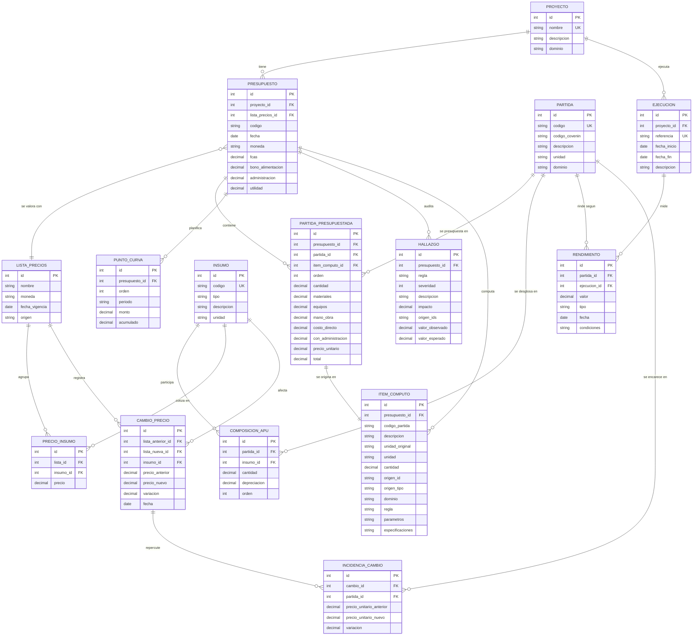

# Modelo de datos

> Estado: **aprobado en la Sesión 0.2**. Materializa en persistencia los contratos de interfaz de
> [CLAUDE.md §5](../CLAUDE.md) sin ampliarlos ni contradecirlos. Los modelos SQLAlchemy de
> `core/models/` (Sesión I0.4) se escriben a partir de este documento y no lo preceden: si el código
> necesita una columna que aquí no está, primero se corrige el documento.

## 1. Requisitos del modelo

| Requisito | Origen | Consecuencia de diseño |
|---|---|---|
| Reconstruir cualquier presupuesto a la fecha en que se elaboró | UC‑02, RNF‑02 | los precios se versionan: `ListaPrecios` con vigencia y `CambioPrecio` como historial; el presupuesto referencia la lista con la que se valoró |
| Distinguir rendimiento estimado de rendimiento medido | UC‑06 | `Rendimiento.tipo` ∈ {estimado, medido}; un rendimiento medido referencia obligatoriamente una `Ejecucion` (restricción `CHECK` en la tabla, no solo en Python) |
| `Decimal` para todo lo monetario y dimensional | CLAUDE.md §2 | tipo propio `DecimalExacto` (§7); nunca `Float`, y tampoco `Numeric` sobre SQLite |
| Toda cantidad es trazable a su origen | CLAUDE.md §2 | `ItemComputo` persistido con `origen_id`, `origen_tipo`, `regla`, `parametros` |
| El núcleo no conoce dominios concretos | CLAUDE.md §5 | `Partida.dominio` es un dato, no una rama de código; ninguna tabla es específica de un dominio |
| El histórico de cambios alimenta el módulo predictivo | I1, I6.3 | `CambioPrecio` guarda insumo, precio anterior, precio nuevo, fecha; `IncidenciaCambio` guarda el efecto por partida |
| El informe de auditoría se persiste, no solo se imprime | CLAUDE.md §2, UC‑05 | `Hallazgo` cuelga del presupuesto auditado y conserva los `origen_id` involucrados |

## 2. Entidades

Quince entidades. Los atributos de cada una se detallan en §2.1 – §2.3, con su tipo lógico y el papel
de la clave (**PK** primaria, **FK** foránea, **UK** única); `DecimalExacto` (§7.1) se abrevia
`Decimal` en esas tablas.

| Entidad | Propósito | Contrato de `core.contracts` que materializa |
|---|---|---|
| `Proyecto` | agrupa presupuestos y ejecuciones de una misma obra | — |
| `Presupuesto` | versión valorada de un proyecto en una fecha, con su lista de precios | `Presupuesto` |
| `PartidaPresupuestada` | renglón del presupuesto: cantidad × precio unitario | `PartidaPresupuestada` |
| `PuntoCurva` | período del plan de trabajo con monto y acumulado | `PuntoCurva` |
| `ItemComputo` | cantidad de obra persistida con su procedencia | `ItemComputo` |
| `Partida` | código, descripción, unidad, dominio | `ComposicionAPU` (cabecera) |
| `Insumo` | material, equipo o mano de obra del catálogo | `LineaMaterial` / `LineaEquipo` / `LineaManoObra` (catálogo) |
| `ComposicionAPU` | relación partida–insumo con cantidad y factor de depreciación | `ComposicionAPU` (líneas) |
| `Rendimiento` | valor, tipo, condiciones, fecha, referencia a ejecución | `Rendimiento` |
| `Ejecucion` | obra ejecutada de la que se mide un rendimiento | `Rendimiento.referencia_ejecucion` |
| `ListaPrecios` | conjunto de precios con fecha de vigencia y moneda | — |
| `PrecioInsumo` | precio de un insumo en una lista | precio de `LineaMaterial` / `LineaEquipo` / sueldo de `LineaManoObra` |
| `CambioPrecio` | historial: qué insumo cambió, cuánto y entre qué listas | — |
| `IncidenciaCambio` | efecto de un cambio de precio sobre el precio unitario de una partida | — |
| `Hallazgo` | resultado persistido de una regla sobre un presupuesto | `Hallazgo` |

### 2.1 Catálogo

**`Partida`** — la cabecera de un APU. El código es la identidad de negocio; la clave primaria es
subrogada para que un cambio de nomenclatura (paso de `LB-` a COVENIN 2000) no propague claves.

| Atributo | Tipo | Clave | Nulo | Notas |
|---|---|---|---|---|
| `id` | int | PK | no | subrogada, autoincremental |
| `codigo` | str(40) | UK | no | `LB-01-EXC` mientras no exista el código normativo |
| `codigo_covenin` | str(40) | — | sí | código COVENIN 2000 cuando se asigne |
| `descripcion` | str(300) | — | no | indexada: búsqueda de UC‑03 |
| `unidad` | str(20) | — | no | normalizada con `normalizar_unidad` |
| `dominio` | str(20) | — | no | valor de `Dominio`; dato, nunca rama de código |

**`Insumo`** — material, equipo o mano de obra. **No lleva precio**: el precio depende del par
(insumo, lista) y vive en `PrecioInsumo` (§4.1).

| Atributo | Tipo | Clave | Nulo | Notas |
|---|---|---|---|---|
| `id` | int | PK | no | |
| `codigo` | str(20) | UK | no | generado: `MAT-001`, `EQU-001`, `MO-001`; sufijo de variante `EQU-007-B` (§6) |
| `tipo` | str(10) | — | no | ∈ {`material`, `equipo`, `mano_obra`} |
| `descripcion` | str(300) | — | no | |
| `unidad` | str(20) | — | sí | solo los materiales la tienen; equipos y mano de obra no la declaran en el contrato |

Índice `ix_insumo_tipo_descripcion (tipo, descripcion)`: es la búsqueda que hace `cargar_composicion`
antes de decidir si reutiliza un insumo o crea una variante.

**`ComposicionAPU`** — una línea del desglose. Su identidad natural es (partida, insumo, orden).

| Atributo | Tipo | Clave | Nulo | Notas |
|---|---|---|---|---|
| `id` | int | PK | no | |
| `partida_id` | int | FK → `Partida.id` | no | |
| `insumo_id` | int | FK → `Insumo.id` | no | |
| `cantidad` | Decimal | — | no | ≥ 0 |
| `depreciacion` | Decimal | — | sí | solo equipos; (0, 1]. Varía entre APU para el mismo insumo (hallazgo 7) |
| `orden` | int | — | no | preserva el orden del PDF; sin él las tuplas del contrato no se reconstruyen iguales |

**`Rendimiento`** — unidades de partida por día, con su procedencia.

| Atributo | Tipo | Clave | Nulo | Notas |
|---|---|---|---|---|
| `id` | int | PK | no | |
| `partida_id` | int | FK → `Partida.id` | no | |
| `valor` | Decimal | — | no | > 0 |
| `tipo` | str(10) | — | no | ∈ {`estimado`, `medido`} |
| `fecha` | date | — | no | fecha de declaración o de medición |
| `condiciones` | str(300) | — | no | cadena vacía si no se declaran |
| `ejecucion_id` | int | FK → `Ejecucion.id` | sí | obligatorio si `tipo = 'medido'` |

`CheckConstraint ck_rendimiento_medido_exige_ejecucion`:
`tipo <> 'medido' OR ejecucion_id IS NOT NULL`. La misma invariante que valida
`contracts.Rendimiento.__post_init__`, escrita también en el esquema para que ningún camino de
carga (script, importación masiva, SQL directo) pueda saltársela.

**`Ejecucion`** — obra ejecutada de la que se mide un rendimiento.

| Atributo | Tipo | Clave | Nulo | Notas |
|---|---|---|---|---|
| `id` | int | PK | no | |
| `referencia` | str(60) | UK | no | lo que el contrato guarda en `Rendimiento.referencia_ejecucion` |
| `proyecto_id` | int | FK → `Proyecto.id` | sí | una ejecución puede ser de un proyecto ajeno al catálogo |
| `fecha_inicio` | date | — | no | |
| `fecha_fin` | date | — | sí | nula mientras la obra está en curso |
| `descripcion` | str(300) | — | no | |

### 2.2 Precios y su historial

**`ListaPrecios`** — el conjunto de precios vigente desde una fecha. **Inmutable una vez que un
presupuesto la referencia** (§5).

| Atributo | Tipo | Clave | Nulo | Notas |
|---|---|---|---|---|
| `id` | int | PK | no | |
| `nombre` | str(120) | — | no | `Linea base 28/04/2026` |
| `moneda` | str(10) | — | no | `USD` |
| `fecha_vigencia` | date | — | no | indexada: `lista_vigente(fecha)` busca el máximo ≤ fecha |
| `origen` | str(200) | — | no | procedencia documental: `APUS_CLINICA.pdf`, boletín, cotización |

**`PrecioInsumo`** — el precio de un insumo en una lista. Para la mano de obra, el jornal diario.

| Atributo | Tipo | Clave | Nulo | Notas |
|---|---|---|---|---|
| `id` | int | PK | no | |
| `lista_id` | int | FK → `ListaPrecios.id` | no | |
| `insumo_id` | int | FK → `Insumo.id` | no | |
| `precio` | Decimal | — | no | ≥ 0 |

`UniqueConstraint uq_precio_insumo_lista_insumo (lista_id, insumo_id)`: un insumo tiene a lo sumo un
precio por lista. El índice que crea esa restricción es el que sirve la consulta de UC‑02 (§7.2).

**`CambioPrecio`** — el historial. Una fila por insumo que cambió entre dos listas.

| Atributo | Tipo | Clave | Nulo | Notas |
|---|---|---|---|---|
| `id` | int | PK | no | |
| `lista_anterior_id` | int | FK → `ListaPrecios.id` | no | |
| `lista_nueva_id` | int | FK → `ListaPrecios.id` | no | indexada (UC‑02) |
| `insumo_id` | int | FK → `Insumo.id` | no | |
| `precio_anterior` | Decimal | — | no | |
| `precio_nuevo` | Decimal | — | no | |
| `variacion` | Decimal | — | no | fracción: (nuevo − anterior) / anterior. Derivada y almacenada (§4.2) |
| `fecha` | date | — | no | fecha del cambio |

**`IncidenciaCambio`** — qué le hizo ese cambio al precio unitario de cada partida que usa el insumo.
Es lo que UC‑02 muestra al usuario: «el cemento subió 20 % y el vaciado de concreto sube 7,4 %».

| Atributo | Tipo | Clave | Nulo | Notas |
|---|---|---|---|---|
| `id` | int | PK | no | |
| `cambio_id` | int | FK → `CambioPrecio.id` | no | |
| `partida_id` | int | FK → `Partida.id` | no | |
| `precio_unitario_anterior` | Decimal | — | no | PU con la lista anterior |
| `precio_unitario_nuevo` | Decimal | — | no | PU con la lista nueva |
| `variacion` | Decimal | — | no | fracción de variación del PU |

### 2.3 Proyecto, presupuesto y auditoría

**`Proyecto`**

| Atributo | Tipo | Clave | Nulo | Notas |
|---|---|---|---|---|
| `id` | int | PK | no | |
| `nombre` | str(200) | UK | no | `Drenaje de la clínica`; la unicidad es lo que hace idempotente a `seed.py` |
| `descripcion` | str(500) | — | no | |
| `dominio` | str(20) | — | no | valor de `Dominio` |

**`Presupuesto`** — una versión valorada. Congela los cuatro parámetros de costo y referencia la lista.

| Atributo | Tipo | Clave | Nulo | Notas |
|---|---|---|---|---|
| `id` | int | PK | no | |
| `codigo` | str(40) | — | no | `001`; único dentro del proyecto |
| `proyecto_id` | int | FK → `Proyecto.id` | no | |
| `fecha` | date | — | no | |
| `moneda` | str(10) | — | no | |
| `lista_precios_id` | int | FK → `ListaPrecios.id` | no | la lista con la que se valoró |
| `fcas` | Decimal | — | no | instantánea de `ParametrosCosto.fcas` |
| `bono_alimentacion` | Decimal | — | no | instantánea de `ParametrosCosto.bono_alimentacion` |
| `administracion` | Decimal | — | no | instantánea de `ParametrosCosto.administracion` |
| `utilidad` | Decimal | — | no | instantánea de `ParametrosCosto.utilidad` |

`UniqueConstraint uq_presupuesto_proyecto_codigo (proyecto_id, codigo)`.

**`PartidaPresupuestada`** — el renglón, con la instantánea completa del `ResultadoAPU`.

| Atributo | Tipo | Clave | Nulo | Notas |
|---|---|---|---|---|
| `id` | int | PK | no | |
| `presupuesto_id` | int | FK → `Presupuesto.id` | no | |
| `partida_id` | int | FK → `Partida.id` | no | |
| `item_computo_id` | int | FK → `ItemComputo.id` | no | la cantidad y su trazabilidad |
| `orden` | int | — | no | orden de presentación |
| `cantidad` | Decimal | — | no | copia de `ItemComputo.cantidad` en el momento de valorar |
| `materiales` | Decimal | — | no | instantánea de `ResultadoAPU.materiales` |
| `equipos` | Decimal | — | no | instantánea de `ResultadoAPU.equipos` |
| `mano_obra` | Decimal | — | no | instantánea de `ResultadoAPU.mano_obra` |
| `costo_directo` | Decimal | — | no | instantánea de `ResultadoAPU.costo_directo` |
| `con_administracion` | Decimal | — | no | instantánea de `ResultadoAPU.con_administracion` |
| `precio_unitario` | Decimal | — | no | instantánea de `ResultadoAPU.precio_unitario` |
| `total` | Decimal | — | no | cantidad × precio_unitario, sin redondear |

**`PuntoCurva`**

| Atributo | Tipo | Clave | Nulo | Notas |
|---|---|---|---|---|
| `id` | int | PK | no | |
| `presupuesto_id` | int | FK → `Presupuesto.id` | no | |
| `orden` | int | — | no | posición en el plan de trabajo |
| `periodo` | str(120) | — | no | `Día 1 Excavación` |
| `monto` | Decimal | — | no | gasto del período |
| `acumulado` | Decimal | — | no | derivada y almacenada (§4.2); la regla R2 la audita |

**`ItemComputo`** — la cantidad de obra con su procedencia. Conserva **dos** unidades.

| Atributo | Tipo | Clave | Nulo | Notas |
|---|---|---|---|---|
| `id` | int | PK | no | |
| `presupuesto_id` | int | FK → `Presupuesto.id` | sí | nulo mientras el cómputo no se ha presupuestado |
| `codigo_partida` | str(40) | — | no | código de negocio, no FK: un cómputo puede citar una partida aún no catalogada (lo detecta la auditoría) |
| `descripcion` | str(300) | — | no | la que escribió el proyectista |
| `unidad_original` | str(20) | — | no | tal cual se escribió: `mts` |
| `unidad` | str(20) | — | no | normalizada: `m`. La regla R3 compara esta con la del APU y reporta la original |
| `cantidad` | Decimal | — | no | ≥ 0 |
| `origen_id` | str(120) | — | no | GlobalId IFC, fila de la tabla, clave del CSV… |
| `origen_tipo` | str(20) | — | no | valor de `OrigenTipo` |
| `dominio` | str(20) | — | no | valor de `Dominio` |
| `regla` | str(300) | — | sí | obligatoria si `origen_tipo = 'regla'` |
| `parametros` | texto JSON | — | no | `{"a": "0.80", "h": "0.80"}`; los `Decimal` se serializan como cadena (§7.1) |
| `especificaciones` | texto JSON | — | no | `{"diametro": "4 pulg", "material": "PVC"}` |

**`Hallazgo`** — el informe de auditoría persistido.

| Atributo | Tipo | Clave | Nulo | Notas |
|---|---|---|---|---|
| `id` | int | PK | no | |
| `presupuesto_id` | int | FK → `Presupuesto.id` | no | |
| `regla` | str(10) | — | no | `R1`…`R7` |
| `severidad` | int | — | no | valor de `Severidad` (IntEnum) |
| `descripcion` | str(500) | — | no | |
| `impacto` | Decimal | — | sí | monto o cantidad afectada |
| `origen_ids` | texto JSON | — | no | lista de `origen_id`; `[]` si la regla no señala cantidades |
| `valor_observado` | Decimal | — | sí | |
| `valor_esperado` | Decimal | — | sí | |

## 3. Diagrama entidad‑relación



Cardinalidades en palabras:

- Un proyecto tiene cero o más presupuestos; un presupuesto pertenece a exactamente un proyecto.
- Un presupuesto se valora con exactamente una lista de precios; una lista puede valorar muchos.
- Un presupuesto contiene cero o más renglones, cero o más puntos de curva y cero o más hallazgos.
- Un renglón presupuestado corresponde a exactamente un `ItemComputo` y a exactamente una `Partida`.
- Una partida se desglosa en una o más líneas de composición; cada línea referencia un insumo.
- Un insumo cotiza a lo sumo una vez por lista (`UNIQUE (lista_id, insumo_id)`).
- Una partida tiene cero o más rendimientos; un rendimiento medido pertenece a una ejecución.
- Un cambio de precio repercute en cero o más partidas (`IncidenciaCambio`).

Cobertura de los ocho casos de uso:

| UC | Entidades que lo sostienen |
|---|---|
| UC‑01 Elaborar presupuesto | `ItemComputo`, `Partida`, `ComposicionAPU`, `Rendimiento`, `ListaPrecios`, `PrecioInsumo`, `Presupuesto`, `PartidaPresupuestada`, `PuntoCurva` |
| UC‑02 Actualizar precios | `ListaPrecios`, `PrecioInsumo`, `CambioPrecio`, `IncidenciaCambio` |
| UC‑03 Reutilizar partidas | `Partida.descripcion` (índice), `ComposicionAPU`, `Insumo` |
| UC‑04 Recalcular alcance | `ItemComputo.regla`, `ItemComputo.parametros` |
| UC‑05 Auditar | `Hallazgo`, `ItemComputo.origen_id`, `PartidaPresupuestada`, `PuntoCurva` |
| UC‑06 Rendimientos reales | `Rendimiento`, `Ejecucion` |
| UC‑07 Precio de mercado | `PartidaPresupuestada.precio_unitario`, `PrecioInsumo`, `CambioPrecio` |
| UC‑08 Sensibilidad | parámetros congelados en `Presupuesto` + `ComposicionAPU` |

## 4. Normalización

### 4.1 Justificación de la tercera forma normal

El esquema está en 3FN. Se comprueba entidad por entidad sobre las dependencias funcionales reales:

- **1FN.** Ningún atributo es multivaluado ni repetitivo. Donde el contrato tiene una colección
  (`ComposicionAPU.materiales`, `Presupuesto.partidas`, `Presupuesto.curva`) el modelo tiene una tabla
  hija con clave foránea. Las dos únicas columnas con estructura interna son
  `ItemComputo.parametros`/`especificaciones` y `Hallazgo.origen_ids`: se justifican en §4.3.
- **2FN.** Toda tabla tiene clave primaria subrogada de un solo atributo, de modo que no existen
  dependencias parciales. Las claves naturales que sí son compuestas se declaran como
  `UniqueConstraint` (`(lista_id, insumo_id)`, `(proyecto_id, codigo)`) y todos los atributos no clave
  de esas tablas dependen del par completo: `PrecioInsumo.precio` no depende solo del insumo ni solo
  de la lista.
- **3FN.** No hay dependencias transitivas. Los tres casos que las habrían producido se resolvieron
  extrayendo tablas:
  1. *El precio no es atributo del insumo.* `precio` depende de (insumo, lista de precios), no del
     insumo. Ponerlo en `Insumo` habría creado `Insumo.id → Insumo.precio_vigente → fecha` y habría
     hecho imposible reconstruir un presupuesto pasado. De ahí `PrecioInsumo`.
  2. *La cantidad y la depreciación no son atributos del insumo ni de la partida.* Dependen del par
     (partida, insumo): la línea base demuestra que el mismo vehículo de transporte lleva 1,00 en
     cuatro APU y 0,03 en el quinto (hallazgo 7). De ahí `ComposicionAPU`.
  3. *El rendimiento no es atributo de la partida.* Una partida acumula varios rendimientos a lo
     largo del tiempo y con distinta procedencia (estimado / medido). De ahí `Rendimiento`, y de ahí
     que `Ejecucion` sea entidad propia en vez de una cadena repetida en cada fila.
- **Moneda.** `Presupuesto.moneda` y `ListaPrecios.moneda` coexisten a propósito: la moneda de la
  lista es la de sus precios y la del presupuesto es la de presentación. No es transitividad, son dos
  hechos distintos; que hoy coincidan (USD) es circunstancial.

### 4.2 Desnormalizaciones deliberadas

Cuatro, todas del mismo tipo: **valores derivados que se almacenan porque su recálculo futuro no
tiene por qué dar el mismo número que dio el día en que se emitió el documento.**

| Dónde | Qué se duplica | Por qué |
|---|---|---|
| `PartidaPresupuestada.materiales … precio_unitario, total` | el `ResultadoAPU` completo del renglón | **la desnormalización principal.** Es la instantánea del versionado híbrido (§5): el presupuesto emitido es un documento con valor contractual y debe poder mostrarse tal como se firmó, aunque después cambien la composición, el rendimiento o la lista. Sin ella, «reconstruir» sería «recalcular», y un cambio de catálogo alteraría retroactivamente presupuestos ya entregados |
| `Presupuesto.fcas, bono_alimentacion, administracion, utilidad` | los cuatro `ParametrosCosto` | los valores por defecto del contrato pueden cambiar (una reforma de prestaciones); el presupuesto conserva los que se le aplicaron |
| `PuntoCurva.acumulado` | suma de los montos anteriores | la regla R2 audita el acumulado **tal como lo escribió el proyectista**. Si se calculara al vuelo, el sistema nunca podría detectar el hallazgo 3 (curva que cierra en 99,30 %), que es precisamente lo que debe detectar |
| `CambioPrecio.variacion`, `IncidenciaCambio.variacion` | (nuevo − anterior) / anterior | se congela con la aritmética `Decimal` del momento del cambio y sirve de columna de ordenación y filtrado en UC‑02 sin expresión calculada |

`PartidaPresupuestada.cantidad` es un quinto caso menor: copia de `ItemComputo.cantidad` por la misma
razón (el cómputo puede corregirse después; el renglón emitido no cambia).

Las cuatro se declaran aquí para que ninguna se tome por descuido: fuera de esta lista, ningún valor
derivado se almacena.

### 4.3 Columnas JSON‑texto

`ItemComputo.parametros`, `ItemComputo.especificaciones` y `Hallazgo.origen_ids` guardan un objeto o
una lista serializados como texto JSON. Es una excepción consciente a la 1FN estricta:

- son **diccionarios abiertos** cuyas claves las decide cada adaptador (`a`, `h`, `e` en civil;
  `longitud_enlace` en telecom). Normalizarlos exigiría una tabla llave‑valor genérica, que en la
  práctica es peor: no aporta integridad referencial (las claves no están en ningún catálogo) y
  multiplica las lecturas;
- nunca se consultan por su contenido: se leen enteros para reevaluar la regla (R1) o comparar
  especificaciones (R4). No hay ninguna consulta de la forma «cantidades con `diametro = 4 pulg`»;
- los valores `Decimal` de `parametros` se serializan como **cadena** (`{"a": "0.80"}`), no como
  número JSON, para que la ida y vuelta sea exacta (§7.1).

Si en el futuro apareciera una consulta por contenido, el reemplazo natural es `JSONB` en PostgreSQL
con índice GIN, sin cambiar el resto del esquema.

## 5. Estrategia de versionado

**Híbrida: el presupuesto referencia su lista de precios y además congela el resultado valorado.**

1. `ListaPrecios` es **inmutable una vez que un presupuesto la referencia**. Actualizar precios no es
   editar una lista: es crear una lista nueva con `fecha_vigencia` posterior y registrar en
   `CambioPrecio` las diferencias insumo por insumo.
2. `Presupuesto.lista_precios_id` deja constancia de con qué precios se valoró, y los cuatro
   parámetros de costo quedan copiados en la propia fila.
3. `PartidaPresupuestada` congela el `ResultadoAPU` de cada renglón. Es la parte «documento» del
   modelo: lo que se firmó.
4. **Reconstruir a fecha = valorar con la lista vigente a esa fecha.**
   `Catalogo.lista_vigente(fecha)` devuelve la lista de mayor `fecha_vigencia ≤ fecha`, y
   `Catalogo.composicion(codigo, fecha)` arma la `ComposicionAPU` con los precios de esa lista y con
   el rendimiento **estimado** más reciente cuya `fecha ≤ fecha`. Ese es el mecanismo que sostiene
   UC‑02: comparar el mismo APU valorado con dos listas distintas.

Las dos vías responden preguntas distintas y por eso conviven:

| Pregunta | Se responde con |
|---|---|
| ¿Qué decía el presupuesto que emitimos el 28/04/2026? | la instantánea de `PartidaPresupuestada` |
| ¿Cuánto costaría hoy ese mismo APU? | `Catalogo.composicion(codigo)` con la lista vigente |
| ¿Cuánto subió y por culpa de qué insumo? | `CambioPrecio` + `IncidenciaCambio` |

Consecuencia operativa: **`seed.py` y `cargar_composicion` nunca modifican una lista ya usada**; si un
precio difiere del que ya tiene un insumo en esa lista, se crea una variante de insumo (§6), no se
sobreescribe el precio.

Lo que este esquema **no** versiona todavía, y se declara como limitación: las líneas de
`ComposicionAPU` no tienen vigencia temporal. Cambiar el desglose de una partida (añadir un insumo,
cambiar una cantidad) altera el APU reconstruible a fechas pasadas. No afecta a los presupuestos
emitidos, que están congelados en `PartidaPresupuestada`, pero sí a la pregunta «cómo se componía
esta partida en abril». Añadir `vigente_desde`/`vigente_hasta` a `ComposicionAPU` es la extensión
natural; se difiere hasta que un caso de uso la exija, para no pagar su complejidad sin necesidad.

## 6. Insumos homónimos con precio distinto (hallazgo de datos de la Sesión I0.4)

La línea base contiene **cuatro pares de insumos con la misma descripción y precios distintos** en la
misma fecha:

| Insumo | Precio A | Dónde | Precio B | Dónde |
|---|---|---|---|---|
| Agua (m3) | 12,00 | vaciado de concreto | 2,00 | relleno compactado |
| Pala | 15,00 | excavación | 10,00 | vaciado de concreto |
| Cinta métrica | 15,00 | tubería | 160,00 | encofrado |
| Nivel de mano | 10,00 | encofrado | 40,00 | vaciado de concreto |

Con `UNIQUE (lista_id, insumo_id)` los dos precios no caben en la misma lista, y el modelo tiene
razón: **un insumo no puede costar dos cosas distintas el mismo día.** Se trata de un octavo defecto
del presupuesto auditado, del mismo tipo que el hallazgo 7 (depreciación no uniforme), y no de una
carencia del esquema.

Política de carga adoptada en `Catalogo.cargar_composicion`, para no alterar la línea base ni ocultar
el defecto:

1. buscar el insumo por (`tipo`, `descripcion`, `unidad`);
2. si existe y su precio en esa lista **coincide**, reutilizarlo;
3. si existe y su precio **difiere**, crear una **variante**: mismo `tipo`, misma `descripcion`, misma
   `unidad`, código con sufijo (`EQU-007-B`, `EQU-007-C`…), y devolverla en `ResumenCarga.variantes`.

Así los cinco APU se reconstruyen **idénticos** al fixture (que es la evidencia primaria y no se
toca), y a la vez queda una lista explícita de los insumos que el presupuesto original contradice.

Esto es candidato a una **regla R8, «precio uniforme del insumo»**: dos líneas de composición que
citan la misma descripción de insumo con precios distintos en la misma fecha son un hallazgo de
severidad ADVERTENCIA. Se decide con el tutor en la Sesión I4, igual que R7.

## 7. Tipos y decisiones de implementación

### 7.1 `DecimalExacto`: el tipo monetario y dimensional

CLAUDE.md §2 exige `Decimal` en todo número monetario y dimensional, sin `float` en ningún punto del
camino. Sobre SQLite eso descarta las dos opciones evidentes:

- `Float` está prohibido por el principio;
- `Numeric` **no** resuelve el problema en SQLite: el motor no tiene tipo decimal nativo, SQLAlchemy
  almacena el valor como `REAL` y lo reconvierte a `Decimal` **pasando por `float`**, lo que emite un
  `SAWarning` en cada consulta y, sobre todo, admite pérdida de precisión.

Decisión: un `TypeDecorator` propio en `core/models/tipos.py`.

```python
class DecimalExacto(TypeDecorator):
    impl = String(40)
    cache_ok = True
    # bind:   Decimal -> str(valor)
    # result: str     -> Decimal(valor)
```

El valor viaja como **texto**, que conserva exactamente los dígitos y la escala del `Decimal`
original (`Decimal("0.415")` vuelve como `Decimal("0.415")`, no como `0.41499999…`). Consecuencias
aceptadas:

- las comparaciones y ordenaciones en SQL son lexicográficas, no numéricas. Ninguna consulta del
  sistema ordena ni filtra por un importe (se filtra por fecha, código, tipo y claves foráneas), así
  que el costo es nulo hoy y está declarado por si deja de serlo;
- la suite corre **sin advertencias**, que es el criterio de aceptación de la Sesión I0.4.

Portabilidad: en PostgreSQL se sustituye por `Numeric(18, 6)`, que sí es decimal exacto en el motor,
sin tocar los modelos más allá del alias del tipo. El mismo criterio de serialización como cadena se
aplica a los `Decimal` dentro de las columnas JSON‑texto (§4.3).

### 7.2 Índices

| Índice | Tabla | Columnas | Para qué |
|---|---|---|---|
| `uq_precio_insumo_lista_insumo` | `PrecioInsumo` | (`lista_id`, `insumo_id`) | **UC‑02**: precio de un insumo en una lista y unicidad del par. Sirve además de índice de cobertura para recorrer una lista completa |
| `ix_cambio_precio_lista_nueva` | `CambioPrecio` | (`lista_nueva_id`) | **UC‑02**: «qué insumos cambiaron al pasar a esta lista», la consulta que abre el informe de actualización |
| `ix_partida_descripcion` | `Partida` | (`descripcion`) | **UC‑03**: búsqueda y reutilización de partidas anteriores por descripción; también es el candidato de recall del normalizador semántico de I2 |
| `ix_insumo_tipo_descripcion` | `Insumo` | (`tipo`, `descripcion`) | resolución de insumos en `cargar_composicion` y detección de homónimos (§6) |
| `ix_lista_precios_fecha_vigencia` | `ListaPrecios` | (`fecha_vigencia`) | `lista_vigente(fecha)`: máximo `fecha_vigencia ≤ fecha` |
| `ix_rendimiento_partida_tipo_fecha` | `Rendimiento` | (`partida_id`, `tipo`, `fecha`) | rendimiento estimado más reciente a una fecha (§5) y separación estimado/medido de UC‑06 |
| `ix_composicion_partida_orden` | `ComposicionAPU` | (`partida_id`, `orden`) | reconstrucción del desglose en el orden del documento original |

Los índices de las claves foráneas restantes (`presupuesto_id` en `PartidaPresupuestada`,
`PuntoCurva`, `ItemComputo` y `Hallazgo`) los crea SQLite implícitamente al resolver las restricciones;
se añadirán explícitamente si el perfilado de I1 los reclama.

## 8. Decisiones ya tomadas

- Los códigos de partida de la línea base usan el prefijo `LB-` hasta que se cargue el catálogo COVENIN
  2000; `Partida` admite un `codigo_covenin` y conserva el código de origen en `codigo`.
- `ComposicionAPU` guarda la cantidad **y** el factor de depreciación por línea, porque la línea base
  demuestra que el factor varía entre APU para el mismo insumo (hallazgo 7). La regla R6 necesita ese dato.
- La unidad se persiste normalizada con `core.contracts.unidades.normalizar_unidad`, pero se conserva la
  unidad original escrita por el usuario en `ItemComputo.unidad_original` para que la regla R3 pueda
  reportarla.
- Los nombres de las entidades son los del diagrama ER aunque siete de ellos coincidan con nombres de
  `core.contracts` (`Presupuesto`, `PartidaPresupuestada`, `PuntoCurva`, `ItemComputo`,
  `ComposicionAPU`, `Rendimiento`, `Hallazgo`). El código los usa **siempre cualificados**
  (`from core import models` → `models.Presupuesto`) y `core/catalog/mapeo.py` es el único lugar donde
  se convierte de modelo a contrato y viceversa.
- Las enumeraciones (`dominio`, `tipo` de insumo, `tipo` de rendimiento, `origen_tipo`) se persisten
  como **texto** con el valor del `StrEnum`, y `severidad` como **entero** con el valor del `IntEnum`.
  No se usa `sqlalchemy.Enum`: el tipo nativo obligaría a una migración de esquema cada vez que se
  añade un dominio, y el sistema está diseñado para admitir dominios nuevos sin tocar el núcleo.
