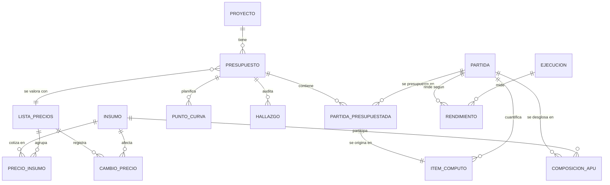

# Modelo de datos

> Estado: **esqueleto**. Se completa en la Sesión 0.2 de [PLAN_DESARROLLO.md](../PLAN_DESARROLLO.md):
> atributos de cada entidad, claves, cardinalidades definitivas y justificación de la normalización.
> Es el paso más importante de la Fase 0 porque materializa el contrato de interfaz en persistencia.
> Los modelos SQLAlchemy se escriben después, en la Sesión I0.4, a partir de este documento.

## 1. Requisitos del modelo

| Requisito | Origen | Consecuencia de diseño |
|---|---|---|
| Reconstruir cualquier presupuesto a la fecha en que se elaboró | UC‑02, RNF‑02 | los precios se versionan: `ListaPrecios` con vigencia y `CambioPrecio` como historial; el presupuesto referencia la lista con la que se valoró |
| Distinguir rendimiento estimado de rendimiento medido | UC‑06 | `Rendimiento.tipo` ∈ {estimado, medido}; un rendimiento medido referencia obligatoriamente una `Ejecucion` |
| `Decimal` para todo lo monetario y dimensional | CLAUDE.md §2 | columnas `Numeric(precision, scale)`; nunca `Float` |
| Toda cantidad es trazable a su origen | CLAUDE.md §2 | `ItemComputo` persistido con `origen_id`, `origen_tipo`, `regla`, `parametros` |
| El núcleo no conoce dominios concretos | CLAUDE.md §5 | `Partida.dominio` es un dato, no una rama de código; ninguna tabla es específica de un dominio |
| El histórico de cambios alimenta el módulo predictivo | I1, I6.3 | `CambioPrecio` guarda insumo, precio anterior, precio nuevo, fecha e incidencia por partida |

## 2. Entidades

| Entidad | Propósito | Contrato de `core.contracts` que materializa | Atributos `[0.2]` |
|---|---|---|---|
| `Proyecto` | agrupa presupuestos de una misma obra | — | `[0.2]` |
| `Presupuesto` | versión valorada de un proyecto en una fecha, con su lista de precios | `Presupuesto` | `[0.2]` |
| `PartidaPresupuestada` | renglón del presupuesto: cantidad × precio unitario | `PartidaPresupuestada` | `[0.2]` |
| `PuntoCurva` | período del plan de trabajo con monto y acumulado | `PuntoCurva` | `[0.2]` |
| `ItemComputo` | cantidad de obra persistida con su procedencia | `ItemComputo` | `[0.2]` |
| `Partida` | código, descripción, unidad, dominio | `ComposicionAPU` (cabecera) | `[0.2]` |
| `Insumo` | material, equipo o mano de obra | `LineaMaterial` / `LineaEquipo` / `LineaManoObra` (catálogo) | `[0.2]` |
| `ComposicionAPU` | relación partida–insumo con cantidad y factor de depreciación | `ComposicionAPU` (líneas) | `[0.2]` |
| `Rendimiento` | valor, tipo, condiciones, fecha, referencia a ejecución | `Rendimiento` | `[0.2]` |
| `Ejecucion` | obra ejecutada de la que se mide un rendimiento | — | `[0.2]` |
| `ListaPrecios` | conjunto de precios con fecha de vigencia y moneda | `ParametrosCosto` (parámetros de la lista) | `[0.2]` |
| `PrecioInsumo` | precio de un insumo en una lista | — | `[0.2]` |
| `CambioPrecio` | historial: qué cambió, cuánto y con qué incidencia | — | `[0.2]` |
| `Hallazgo` | resultado persistido de una regla sobre un presupuesto | `Hallazgo` | `[0.2]` |

## 3. Diagrama entidad‑relación (borrador)

Solo entidades y relaciones; los atributos se añaden en la Sesión 0.2.

## 4. Decisiones ya tomadas

- Los códigos de partida de la línea base usan el prefijo `LB-` hasta que se cargue el catálogo COVENIN
  2000 (Sesión I0.4); la tabla `Partida` admitirá un código COVENIN y un alias de origen.
- `ComposicionAPU` guarda la cantidad **y** el factor de depreciación por línea, porque la línea base
  demuestra que el factor varía entre APU para el mismo insumo (hallazgo 7). La regla R6 necesita ese dato.
- La unidad se persiste normalizada con `core.contracts.unidades.normalizar_unidad`, pero se conserva la
  unidad original escrita por el usuario en `ItemComputo` para que la regla R3 pueda reportarla.

## 5. Pendiente `[0.2]`

- Atributos, tipos (`Numeric`), claves primarias y foráneas de cada entidad.
- Justificación de la normalización (3FN) y de las desnormalizaciones deliberadas, si las hay.
- Estrategia de versionado: ¿`Presupuesto` congela una copia de los precios usados o solo referencia la lista?
- Índices para las consultas de UC‑02 (insumos afectados por una lista nueva) y UC‑03 (búsqueda por descripción).
